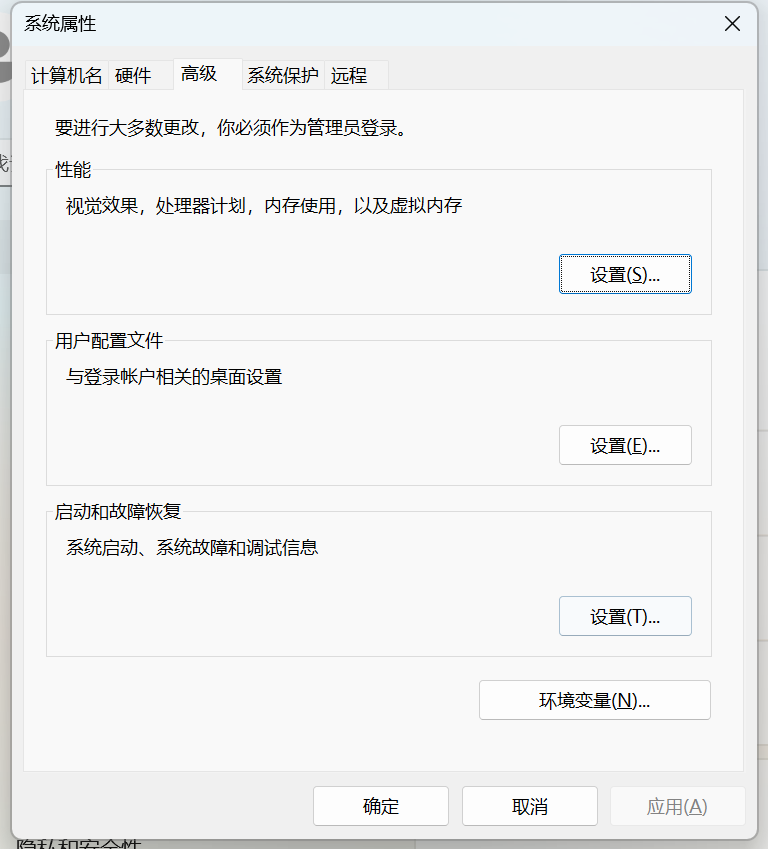
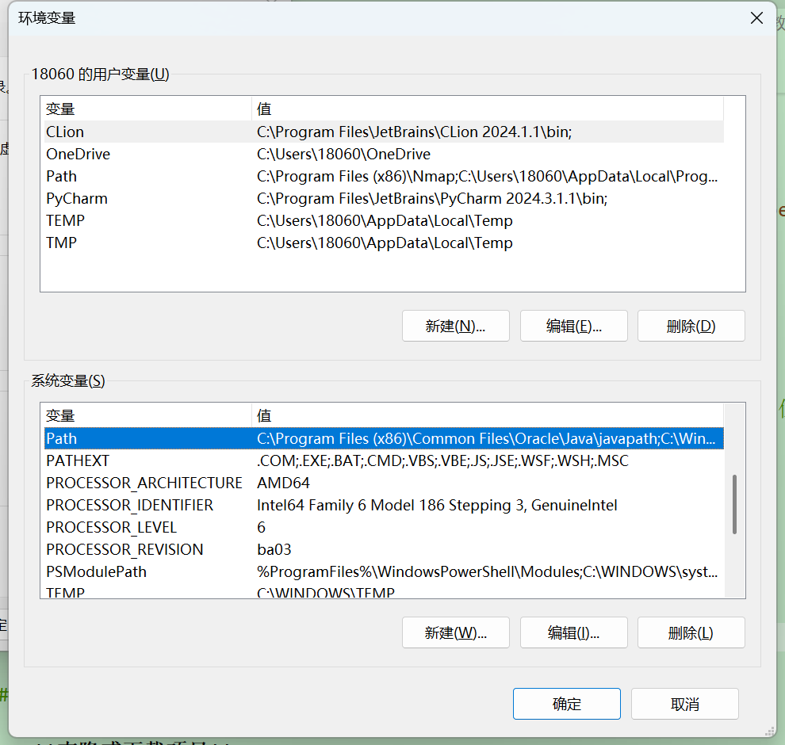

# 视频课程智能笔记 Agent (Web版)

这是一个基于 Streamlit 的Web应用，旨在将视频、音频甚至文本文档高效地转换为结构化的笔记、问答对（Q&A）或概念测验题。用户只需通过浏览器上传文件、输入必要的API密钥，即可一键完成所有处理流程。

## ✨ 功能特性

- **多功能Web界面**: 基于 Streamlit 构建，界面友好，交互便捷。
- **灵活的输出模式**: 支持生成结构化笔记 (`Notes`)、问答对 (`Q&A`) 和测验题 (`Quiz`)，输出可以下载
- **参数可配置**: 用户可直接在网页上输入 OpenAI API Key 和自定义输出文件名。
- **多种文件输入**: 支持视频、音频和多种文本文档格式。
- **实时进度反馈**: 通过进度条和状态消息，实时展示视频切分、语音转录和AI处理的进度。
- **高效并行处理**: 后端采用多线程对视频切分和语音转录进行并行处理，极大提升效率。
- **结果展示与下载**: 处理完成后直接在页面预览生成的文本，并提供一键下载功能。

## 📂 项目结构

├── temp_uploads/         # (自动创建) 临时存放上传的文件
├── output_chunks/        # (自动创建) 存放切分的音频块
├── .gitignore            # Git忽略文件配置
├── .env                  # 环境变量文件
├── README.md             # 本说明文档
├── requirements.txt      # Python依赖包
├── app.py                # Streamlit Web应用主入口
├── main.py               # 核心处理逻辑
├── config.py             # 配置文件读取
├── dify_api.py           # Dify API 交互模块
├── splitter.py           # 媒体文件切分模块
├── transcriber.py        # 语音转录模块 (Whisper)
└── utils.py              # 通用工具函数

## 🚀 如何运行

### 1. 前提条件

- **Python 3.8+**
- **FFmpeg**: 这是视频和音频处理所必需的。 请确保您已在系统中安装了 FFmpeg，并且其路径已添加到系统环境变量中。

#### ffmpeg安装教程

访问官方下载界面 https://ffmpeg.org/download.html

根据您的系统架构下载文件。如果下载的是压缩包，将解压后文件放在一个您喜欢的位置

之后需要配置系统的环境变量：



点击"环境变量"，然后选择下方的系统变量--Path



点击右上角的新建，加入一个文件地址

这个地址是刚刚解压的ffmpeg压缩包的bin文件夹的位置，比如C:\ffmpeg\bin

然后全部点确定

为了检验ffmpeg是否安装成功，可以启动cmd，输入ffmpeg -version

如果安装成功，您将看到ffmpeg相关的版本信息和库信息


### 2. 安装与配置

1.  **克隆或下载项目**
    将所有项目文件保存在本地文件夹中。

2.  **创建并激活虚拟环境** (推荐)
    ```bash
    python -m venv venv
    # Windows
    .\venv\Scripts\activate
    # macOS / Linux
    source venv/bin/activate
    ```

    也可以使用anaconda创建虚拟环境
    ```bash
    conda create -n venv python=3.11
    conda activate venv
    ```
    其中-n后面的是虚拟环境的名字，可以自定义，python版本也可以自定义但必须>3.8

3.  **安装所有依赖**
    在终端中运行以下命令，安装所有需要的库：
    ```bash
    pip install -r requirements.txt
    ```

### 3. 启动Web应用

在您的命令行终端中，运行以下命令：

```bash
streamlit run app.py
```

### 4.Web应用的使用

左下角可以选择任务类型

需要生成笔记则选择"Notes"，可以传入回放文件/课程录音稿/录音转写稿

需要启动ai基础课程问答则选择"Q&A"，传入一个文档（比如.txt文件），将问题写在文档文件中

需要根据课程录音转文字稿/课程笔记生成测试题则选择"Quiz"，传入文档即可

可以上传的文件类型已展示在Web应用界面